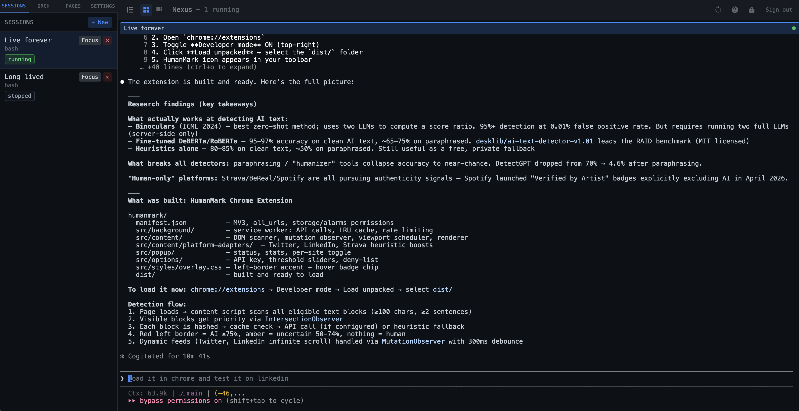
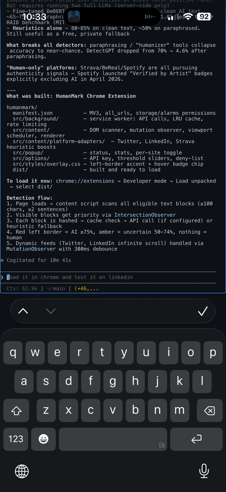

# Nexus — Secure Web Terminal Gateway

> Run native terminal sessions on your Mac or Linux server and access them from any browser — including mobile — over your private Tailscale network. Built for developers who want full shell access everywhere without exposing SSH to the internet.

---

## Screenshots

**Desktop** — grid layout with sidebar, multiple sessions, Claude Code running in the active pane



**Mobile** — full-screen terminal with quick-access keybar, keyboard-aware viewport, swipe to switch sessions



---

## What is Nexus?

Nexus is a self-hosted web terminal gateway. It opens real PTY processes (bash, zsh, Python, Claude Code, or any command) directly on your server and streams them to a browser over WebSocket. No Docker containers for your sessions, no SSH tunnels, no cloud relay — just a thin FastAPI layer that turns your terminal into a browser tab.

Typical uses:
- **Claude Code on the go** — run multiple AI coding agents from your phone while away from your desk
- **Remote shell access** — full terminal from any device on your Tailscale network without opening SSH
- **Parallel agent orchestration** — open 6 Claude Code sessions, watch them work in the grid, and use the Orchestrator to coordinate them automatically

---

## Key Features

### Terminal & Sessions
- **Native PTY sessions** — real OS processes (`os.openpty`), not containers; full color, Unicode, resize
- **Up to 6 concurrent sessions** — configurable; each session persists until explicitly closed or the process exits
- **Grid and Priority layouts** — switch between equal-size grid and an 80/20 split that auto-promotes the most active session
- **Multi-tab support** — open the same session in multiple browser tabs; all tabs share one PTY reader
- **Session recovery** — on graceful shutdown, ring buffers are serialized; sessions replay buffered output on the next connect
- **Visibility-triggered reconnect** — returning from a backgrounded tab automatically reconnects WebSocket and replays missed output
- **Inactivity detection** — amber pulsing border and sidebar badge after 60 seconds of no output

### Security & Authentication
- **Passwordless biometric login** — one tap of Face ID / Touch ID / hardware key signs you in; no username or password required
- **Passkey / WebAuthn (FIDO2)** — `py-webauthn` server + `@simplewebauthn/browser`; multiple keys per account; add, rename, and remove from Settings; user-verification enforced at both registration and authentication
- **TOTP two-factor** — Google Authenticator, Authy, 1Password; QR setup in the login flow; replay protection
- **Email OTP** — 6-digit codes via SMTP, bcrypt-hashed, 10-minute TTL, single-use
- **MFA method selector** — when multiple methods are registered, login presents an Okta-style card picker (Face ID / Authenticator / Email); only registered methods are shown
- **Flexible MFA switching** — switch between TOTP, email code, or passkey from the login verification screen without re-registering
- **Account recovery** — "Lost access to authenticator?" emails a single-use reset link (15-min TTL)
- **Strong password enforcement** — 16+ chars, upper/lower/digit/special required
- **Account lockout** — 5 failed attempts → 15-minute lockout
- **JWT revocation** — logout, password change, and email change immediately invalidate the current token
- **Rate limiting** — every sensitive endpoint protected via slowapi (see Security section for full table)
- **Secure by default** — httpOnly/Secure/SameSite=Strict cookies; strict CSP; HSTS with preload; WebAuthn UV enforced; no Swagger/ReDoc in production

### Mobile & PWA
- **Full-screen mobile layout** — hamburger opens a solid overlay sidebar; terminal fills 100% of the dynamic viewport (`h-dvh`); no empty space when the keyboard is hidden
- **iOS/Android keyboard support** — quick-access keybar (Tab, ^C, Paste, arrows, ESC, ^D); Mic button for voice-to-text; visualViewport resize listener refits xterm when the soft keyboard appears
- **Correct column count** — xterm waits for custom fonts (`document.fonts.ready`) before measuring character width, so the PTY always gets the right column count
- **Swipe to switch sessions** — horizontal swipe gesture on mobile switches between sessions
- **PWA re-auth on every open** — adding to the iOS/Android home screen requires Face ID/Touch ID on every launch via `sessionStorage` stamp + server-side cookie revocation

### Orchestration & Automation
- **Orchestrator panel** — sidebar tab showing real-time state (WORKING / WAITING / ASKING / BUSY) for every session; batch-send to all WAITING sessions at once; voice-to-text input
- **`wctl.py` CLI** — zero-dependency Python CLI wrapping the orchestration API; supports `states`, `buffer`, `send`, `wait`, and `broadcast` commands for scripted pipelines
- **Mastermind** — paste the `/mastermind` command into a Claude Code session to activate an autonomous coordinator that reads all session buffers, decides what to type, and reschedules itself via `CronCreate`

### Settings & Account Management
- **Settings panel** — Profile (change email), Security (change password), Passkeys (list/add/remove keys), Danger Zone (delete account with typed confirmation)
- **Web page embedding** — embed HTTPS pages as sandboxed iframes in a split panel alongside terminals (desktop) or full-screen overlay (mobile)
- **Workspace grouping** — named, color-coded groups for organizing sessions
- **Prometheus metrics** — `GET /api/metrics` exposes `sessions_active`, `ws_connections`, `pty_bytes_read`, uptime
- **Structured JSON logging** — configurable via `log_format: json`; includes `user_id`, `session_id`, IP context
- **Auto TLS renewal** — background task renews Tailscale cert every 6 hours when within 30 days of expiry

---

## Architecture

```
Browser (HTTPS / WSS)
  └─ Caddy 2 in Docker  (TLS termination · static files · reverse proxy)
       └─ FastAPI on host:8000  (auth · sessions · WebSocket)
            ├─ SQLite  (~/.nexus/nexus.db)
            └─ PTY processes on host  (bash, zsh, python3, claude, …)
```

### Why the backend runs on the host (not in Docker)

Sessions are native PTY processes (`os.openpty()` + `subprocess.Popen`). The backend must run directly on the host to spawn processes with the user's environment, dotfiles, and ssh-agent. Caddy stays in Docker and proxies to `host.docker.internal:8000`.

### PTY broadcaster

One asyncio reader task per session fans PTY output to N subscriber queues (one per WebSocket tab). This eliminates the race condition where two `os.read()` calls on the same fd would each steal half the output.

---

## Prerequisites

| Tool | Version | Notes |
|------|---------|-------|
| Python | 3.11+ | Backend |
| Node.js | 18+ | Frontend build |
| Docker + Compose | any recent | Caddy only — [Colima](https://github.com/abiosoft/colima) (free) recommended over Docker Desktop |
| Tailscale | any | For HTTPS via `.ts.net` cert |
| `openssl` | system | Secret generation |

---

## Quick Start

### 1. Clone

```bash
git clone https://github.com/YOUR_USERNAME/nexus
cd nexus
```

### 2. Generate secrets

```bash
echo "APP_SECRET=$(openssl rand -hex 32)" > .env
echo "JWT_SECRET=$(openssl rand -hex 32)" >> .env
echo "CRYPTO_SALT=$(openssl rand -hex 16)" >> .env
```

### 2b. Configure Email OTP (optional)

If you want users to authenticate via email code instead of an authenticator app, add SMTP credentials:

```bash
cat >> .env <<'EOF'
SMTP_HOST=smtp.gmail.com
SMTP_PORT=587
SMTP_USER=your-email@gmail.com
SMTP_PASSWORD=your-app-specific-password
SMTP_FROM=Nexus <your-email@gmail.com>
EOF
```

> **Gmail users:** Create an [App Password](https://myaccount.google.com/apppasswords) (requires 2FA enabled on your Google account). Use the 16-character app password as `SMTP_PASSWORD`.

Without SMTP configured, users can still register and use TOTP (authenticator app) for MFA. The "Email Code" option is always visible on the login screen; switching to it when SMTP is not configured returns a descriptive error rather than a generic failure.

### 3. Configure Tailscale HTTPS (recommended)

Nexus is designed to be accessed over your Tailscale private network. Tailscale provides automatic HTTPS via Let's Encrypt for every machine on your tailnet.

> **Why HTTPS is required:** `.ts.net` domains are on Chrome's and Firefox's HSTS preload list. Browsers unconditionally upgrade all requests to HTTPS, so plain HTTP will never load — you must have a valid TLS cert.

#### a. Install Tailscale and log in

```bash
# macOS
brew install tailscale
sudo tailscale up

# Linux
curl -fsSL https://tailscale.com/install.sh | sh
sudo tailscale up
```

Confirm the machine is visible in your tailnet:

```bash
tailscale status        # should show your machine as online
tailscale ip -4         # e.g. 100.x.x.x
```

#### b. Provision a TLS certificate

```bash
sudo tailscale cert <your-machine>.tail<id>.ts.net
```

Copy the cert and key into the repo's `certs/` directory (gitignored):

```bash
cp <hostname>.tail<id>.ts.net.crt /path/to/nexus/certs/
cp <hostname>.tail<id>.ts.net.key /path/to/nexus/certs/
```

#### c. Update the Caddyfile

Replace the hostname and cert paths in `Caddyfile`:

```caddy
your-machine.tail12345.ts.net {
  tls /certs/your-machine.tail12345.ts.net.crt \
      /certs/your-machine.tail12345.ts.net.key
  ...
}
```

#### d. Renew certificates

Tailscale certificates expire every ~90 days. Renew with:

```bash
sudo tailscale cert <hostname>.tail<id>.ts.net
cp <new files> certs/
docker compose restart caddy
```

### 4. Build frontend

```bash
cd frontend
npm install
npm run build
cd ..
```

### 5. Start Caddy

```bash
# Install Colima (macOS, free Docker Desktop alternative)
brew install colima docker docker-compose
colima start

# Start Caddy
docker compose up -d
```

### 6. Start backend

```bash
cd backend
python3 -m venv .venv
source .venv/bin/activate
pip install -r requirements.txt
cd ..
source .env
export CONFIG_PATH="$PWD/config.yml"
cd backend
uvicorn app.main:app --host 0.0.0.0 --port 8000
```

Or run `./start.sh` from the repo root — it handles venv, frontend build, Docker, and backend in one command.

#### Running without Caddy (development)

```bash
export STATIC_DIR="$PWD/frontend/dist"
# Backend serves the SPA directly at http://localhost:8000
```

### 7. Create your account

```bash
curl -X POST http://localhost:8000/api/auth/create-user \
  -H 'Content-Type: application/json' \
  -d '{"username":"admin","password":"YourStr0ng@Password!"}'
```

This endpoint is permanently disabled once any user exists.

### 8. Set up MFA

On your first login, choose your preferred second factor:

- **Authenticator App (TOTP)** — scan the QR code with Google Authenticator, Authy, or 1Password
- **Email Code** — a 6-digit code is sent to your account email each time you log in (requires SMTP)
- **Passkey** — register Face ID, Touch ID, or a hardware security key; no codes to type

#### WebAuthn / Passkey configuration

```yaml
# config.yml
webauthn:
  rp_id: your-machine.tail12345.ts.net         # Must match the hostname in the browser URL bar
  rp_name: Nexus
  origin: https://your-machine.tail12345.ts.net
```

`rp_id` must exactly match the hostname users access the app on. If it doesn't match, WebAuthn registration and authentication will fail.

---

## Configuration

### `.env` — secrets (never commit)

| Variable | Required | Description |
|----------|----------|-------------|
| `APP_SECRET` | Yes | Master key for AES-256-GCM TOTP secret encryption (≥ 32 chars) |
| `JWT_SECRET` | Yes | HMAC-SHA256 JWT signing key (≥ 32 chars) |
| `CRYPTO_SALT` | Yes | PBKDF2 salt for key derivation (≥ 16 chars) |

### `config.yml` — non-secret runtime config

```yaml
app:
  max_panes: 6
  log_level: INFO
  db_path: ~/.nexus/nexus.db

session:
  idle_timeout_seconds: 86400
  jwt_expire_minutes: 1440      # 24 hours

webauthn:
  rp_id: your-machine.tail12345.ts.net
  rp_name: Nexus
  origin: https://your-machine.tail12345.ts.net

presets:
  - name: bash
    command: ["/bin/bash", "-l"]
    description: Login shell
  - name: zsh
    command: ["/bin/zsh", "-l"]
    description: Zsh login shell
  - name: claude
    command: ["claude"]
    description: Claude Code CLI
  - name: python
    command: ["python3"]
    description: Python 3 REPL
```

Secrets must **never** appear in `config.yml`. The config loader rejects any key whose name contains `secret`, `password`, `token`, or `apikey` and raises an error at startup.

---

## API Reference

All API routes are under `/api/`.

| Method | Path | Auth | Description |
|--------|------|------|-------------|
| **Auth** | | | |
| POST | `/api/auth/login` | — | `username`, `password`, `totp_code` (optional first step) |
| POST | `/api/auth/logout` | Cookie | Revokes JWT, clears cookie |
| GET | `/api/auth/me` | Cookie | Returns `{id, username, mfa_method, has_totp}` |
| POST | `/api/auth/create-user` | — | Self-registration (disabled after first user) |
| POST | `/api/auth/setup-mfa` | Form password | Choose TOTP or email_otp |
| POST | `/api/auth/switch-mfa` | Form password | Switch between TOTP and email OTP |
| POST | `/api/auth/resend-otp` | Form password | Resend email OTP code |
| POST | `/api/auth/recovery/request` | — | Send MFA reset link |
| POST | `/api/auth/recovery/reset` | — | Consume recovery token, clear MFA |
| POST | `/api/auth/refresh` | Cookie | Re-issue JWT (called every 30 min by frontend) |
| GET | `/api/auth/ws-token` | Cookie | Single-use 60-second WS auth token |
| **Passkey / WebAuthn** | | | |
| POST | `/api/auth/passkey/setup/begin` | Form password | Begin first-time passkey registration |
| POST | `/api/auth/passkey/setup/complete` | Form password | Complete passkey registration |
| POST | `/api/auth/passkey/authenticate/begin` | — | Return assertion options |
| POST | `/api/auth/passkey/authenticate/complete` | — | Verify assertion, issue cookie |
| POST | `/api/auth/passkey/login/begin` | — | Passwordless login — no username required |
| POST | `/api/auth/passkey/login/complete` | — | Verify passwordless assertion |
| POST | `/api/auth/passkey/register/begin` | Cookie | Add an additional passkey |
| POST | `/api/auth/passkey/register/complete` | Cookie | Complete adding a new passkey |
| GET | `/api/auth/passkey/credentials` | Cookie | List registered passkeys |
| DELETE | `/api/auth/passkey/credentials/{id}` | Cookie | Remove a passkey |
| **Sessions** | | | |
| GET | `/api/sessions` | Cookie | List all sessions |
| POST | `/api/sessions` | Cookie | Create a session (spawns PTY) |
| DELETE | `/api/sessions/{id}` | Cookie | Stop and delete a session |
| POST | `/api/sessions/{id}/restart` | Cookie | Restart a stopped session |
| PATCH | `/api/sessions/{id}/resize` | Cookie | Resize terminal |
| WS | `/ws/session/{id}?token=…` | WS token | Bidirectional PTY I/O |
| **Orchestration** | | | |
| GET | `/api/orchestration/sessions/states` | Cookie | Classified state for all running sessions |
| GET | `/api/orchestration/sessions/{id}/state` | Cookie | State + idle seconds |
| GET | `/api/orchestration/sessions/{id}/buffer` | Cookie | Last N lines of terminal output |
| POST | `/api/orchestration/sessions/{id}/input` | Cookie | Send keystrokes |
| **Workspaces** | | | |
| GET/POST | `/api/workspaces` | Cookie | List / create |
| PATCH/DELETE | `/api/workspaces/{id}` | Cookie | Update / delete |
| **Pages** | | | |
| GET/POST | `/api/pages` | Cookie | List / create |
| PATCH/DELETE | `/api/pages/{id}` | Cookie | Update / delete |
| **Monitoring** | | | |
| GET | `/api/health` | — | Database, watchdog, PTY status + uptime |
| GET | `/api/metrics` | Cookie | Prometheus-format counters and gauges |

### WebSocket frames (JSON)

**Client → server:**

| Type | Fields | Description |
|------|--------|-------------|
| `input` | `data: string` | Raw keystrokes to write to PTY |
| `resize` | `cols: number, rows: number` | Terminal resize |
| `ping` | — | Keepalive |

**Server → client:**

| Type | Fields | Description |
|------|--------|-------------|
| `output` | `data: string` | Base64-encoded PTY bytes |
| `pong` | — | Reply to ping |
| `session_dead` | `reason: string` | Process exited |
| `error` | `message: string` | Protocol error |

---

## wctl.py — Orchestration CLI

Zero-dependency Python CLI for programmatic session control. Wraps the `/api/orchestration/*` endpoints.

```bash
python3 wctl.py --url https://your-host.ts.net --cookie <access_token> <subcommand>
```

| Command | Description |
|---------|-------------|
| `sessions` | List all sessions |
| `states` | Classify state of all running sessions |
| `state SESSION_ID` | State + idle seconds for one session |
| `buffer SESSION_ID [--lines N]` | Last N lines of terminal output (default 100) |
| `send SESSION_ID TEXT` | Send keystrokes — include `\n` for Enter |
| `wait SESSION_ID STATE [--timeout N]` | Poll until session reaches target state |
| `broadcast TEXT` | Send text to every WAITING session at once |

Valid states: `WORKING`, `WAITING`, `ASKING`, `BUSY`.

### Example — unblock all waiting agents

```bash
URL="https://nexus.tail12345.ts.net"
COOKIE="eyJhbGci..."

python3 wctl.py --url $URL --cookie $COOKIE states
python3 wctl.py --url $URL --cookie $COOKIE broadcast "y\n"
```

### Example — scripted pipeline

```bash
# Wait for Claude to finish, send next prompt, read output
python3 wctl.py --url $URL --cookie $COOKIE wait $SESSION_ID WAITING --timeout 300
python3 wctl.py --url $URL --cookie $COOKIE send $SESSION_ID "Run the tests and report\n"
python3 wctl.py --url $URL --cookie $COOKIE wait $SESSION_ID WAITING --timeout 120
python3 wctl.py --url $URL --cookie $COOKIE buffer $SESSION_ID --lines 200
```

---

## Running Parallel Claude Code Agents (Mastermind)

The most powerful use case for Nexus is coordinating multiple Claude Code sessions from a single browser tab.

1. **Open 2–6 sessions** using the `Claude Code` preset. Give them descriptive names (`agent-api`, `agent-tests`, etc.)
2. **Assign work** — type a prompt into each session's terminal
3. **Watch the Orchestrator panel** — it shows WORKING / WAITING / ASKING state in real time
4. **Unblock agents** — when sessions hit a confirmation prompt (ASKING), use "Send to all WAITING" or `wctl.py broadcast "y\n"`
5. **Activate Mastermind** — click "Copy /mastermind Command" in the Orchestrator panel and paste it into a Claude Code session. It reads every session's state and buffer, decides what to type, and reschedules itself every 3 minutes via `CronCreate` — fully autonomous from that point
6. **Monitor with Priority layout** — enable auto-promote (▶) so the most recently active session always gets the large primary pane

---

## Troubleshooting

### App won't start

**Missing secrets**
```
KeyError: 'APP_SECRET'
```
Make sure `.env` exists and is sourced: `source .env`

**Port 8000 in use**
```bash
lsof -ti:8000 | xargs kill
```

**Database migration error**
```bash
cd backend && DB_PATH=~/.nexus/nexus.db alembic upgrade head
```

---

### Can't log in

**"Account locked"** — 5 failed attempts trigger a 15-minute lockout. Wait and try again.

**"TOTP code invalid"** — Check your device clock is synced (`date` on the server vs. your phone). TOTP requires clocks within ~30 seconds.

**Email code not arriving** — Check spam. Verify SMTP in `.env`. Click "Resend code" (rate-limited to 3/min). Code is valid 10 minutes.

**Passkey fails with "Passkey verification failed"** — `rp_id` in `config.yml` must exactly match the hostname in the browser address bar. Update and restart the backend. Credentials registered against a different hostname cannot be reused — re-register.

**Passkey "No passkeys registered"**
```bash
sqlite3 ~/.nexus/nexus.db "UPDATE users SET mfa_method = NULL WHERE username = 'your@email.com';"
```

**Lost authenticator app** — Use the "Lost access to authenticator?" link on the TOTP login step to receive a reset email (requires SMTP). Or via CLI:
```bash
curl -X POST http://localhost:8000/api/auth/bootstrap-totp \
  -d "username=your@email.com&password=YourPassword"
```

**Switch MFA method via database**
```bash
sqlite3 ~/.nexus/nexus.db "UPDATE users SET mfa_method = NULL, encrypted_totp_secret = NULL WHERE username = 'your@email.com';"
```

---

### Session issues

**Session shows "stopped" immediately** — The preset command failed to spawn. Check `config.yml` — the command must exist on the host. For `claude`, run `which claude`.

**Terminal output jumbled** — PTY column width mismatch. Resize the browser window to trigger a fresh resize event, or delete and recreate the session.

**WebSocket disconnects** — Caddy must have `flush_interval -1` and `read_timeout 0` on the `/ws/*` route. Check your Caddyfile. If disconnected from backgrounding, the terminal reconnects and replays output automatically on return.

**"Maximum sessions reached"** — Delete a stopped session to free a slot, or increase `max_panes` in `config.yml`.

---

### TLS / HTTPS

**Browser refuses to connect** — Run `tailscale cert` and copy the cert + key into `certs/`. Tailscale `.ts.net` domains require HTTPS (HSTS preloaded).

**Certificate expired** — Renew with `sudo tailscale cert <hostname>`, copy to `certs/`, then `docker compose restart caddy`. Nexus's background task also checks every 6 hours.

---

## Database Schema

Managed by Alembic (8 migrations in `backend/alembic/versions/`).

| Table | Purpose |
|-------|---------|
| `users` | Credentials, encrypted TOTP secret (AES-GCM), `mfa_method`, lockout state |
| `sessions` | Session metadata: name, preset, status, cols/rows, workspace_id |
| `ws_tokens` | Single-use WS auth tokens |
| `revoked_tokens` | Logout-revoked JWT JTIs |
| `audit_log` | Append-only auth and session event log |
| `email_otp_codes` | Pending email OTP codes: bcrypt-hashed, 10-min TTL, single-use |
| `account_recovery_tokens` | MFA reset tokens: SHA-256-hashed, 15-min TTL |
| `passkey_credentials` | WebAuthn/FIDO2 credentials: public key, sign count, transports |
| `webauthn_challenges` | Ephemeral challenge bytes (120-second TTL, single-use) |
| `workspaces` | Named, color-coded session groups |
| `pages` | Embedded HTTPS pages (iframe tabs) |

---

## Security

### Authentication flow

1. Register with email + password via `/api/auth/create-user`
2. Choose MFA method (TOTP, Email OTP, or Passkey)
3. On subsequent logins: POST credentials → server returns `needs_totp`/`needs_email_otp`/`needs_passkey` plus `available_methods[]`; if 2+ methods are registered, an Okta-style card picker is shown
4. For passkey: browser prompts platform authenticator → assertion verified server-side
5. For passwordless: `/passkey/login/begin` (no username) → browser presents any registered passkey → server identifies user from `credential_id`
6. On success: httpOnly/Secure/SameSite=Strict JWT cookie set
7. WebSocket connections require a separate single-use token from `/api/auth/ws-token`

### Hardening summary

| Category | Detail |
|----------|--------|
| Password hashing | bcrypt (12 rounds) on SHA-256 digest (avoids 72-byte truncation) |
| TOTP encryption | AES-256-GCM; key via PBKDF2-HMAC-SHA256 (600,000 rounds); nonce + AAD per record |
| Timing attacks | Unknown usernames always run bcrypt; `hmac.compare_digest` on verify result |
| Rate limiting | slowapi: 10 login/min, 5/min TOTP setup and registration, 30/min refresh, 3/hour recovery |
| Account lockout | 5 failures → 15-minute lockout in DB; enforced at every authenticated request |
| JWT revocation | Logout inserts JTI into `revoked_tokens`; every request checks the revocation table |
| WS token security | Single-use, 60-second TTL, bound to a specific session ID, atomic consume |
| TOTP replay | Used codes recorded; reuse within 90 s rejected |
| Security headers | CSP, HSTS with `preload`, X-Frame-Options, X-Content-Type-Options, Referrer-Policy |
| Passkey | `userVerification=REQUIRED`; sign count validated (clone detection); `rp_id` never derived from request headers |
| CORS | `allow_origins=[]` — no cross-origin requests permitted |
| Absolute session timeout | `auth_time` claim enforced at `/refresh` and `get_current_user`; max 24 h from login |

### Threat model

| Threat | Mitigation |
|--------|-----------|
| Stolen cookie | httpOnly + SameSite=Strict + short TTL + revocation on logout |
| Brute force | Rate limiting + account lockout |
| TOTP replay | Codes recorded with timestamp; reuse within 90 s rejected |
| JWT forgery | HS256 with ≥ 32-byte secret; PyJWT validates `exp`, `iat` |
| WS session hijack | Single-use tokens; 60-second TTL; atomic consume |
| Passkey cloning | Sign count validated; backwards counter → failure |
| Passkey phishing | `rp_id` binds credential to exact hostname |
| Clickjacking | `frame-ancestors 'none'` + `X-Frame-Options: DENY` |
| XSS via terminal | xterm.js renders ANSI, not HTML; strict CSP blocks inline scripts |
| Direct port exposure | Backend binds `127.0.0.1:8000`; not reachable externally |

### Pre-production checklist

- [ ] Generate unique `APP_SECRET`, `JWT_SECRET`, `CRYPTO_SALT` — never reuse across installs
- [ ] Confirm `.env` is in `.gitignore` and never committed
- [ ] Access via Tailscale or VPN only
- [ ] Provision TLS cert and configure Caddy for HTTPS
- [ ] Create your user account and set up MFA
- [ ] Verify `127.0.0.1:8000` is not publicly routable: `ss -tlnp | grep 8000`
- [ ] Back up `~/.nexus/nexus.db` regularly

---

## Development

### Backend

```bash
cd backend
python3 -m venv .venv && source .venv/bin/activate
pip install -r requirements.txt

export APP_SECRET="dev-secret-at-least-32-characters-long"
export JWT_SECRET="dev-jwt-secret-at-least-32-chars-long"
export CRYPTO_SALT="dev-salt-16chars"
export CONFIG_PATH="../config.yml"

uvicorn app.main:app --reload --port 8000
```

### Frontend

```bash
cd frontend
npm install
npm run dev     # Vite dev server on :5173, proxies /api and /ws to :8000
npm run build   # Production build → dist/
```

### Tests

```bash
# Backend
cd backend && source .venv/bin/activate
pip install -r requirements-dev.txt
pytest --cov=app --cov-report=term-missing

# Frontend
cd frontend
npm test
```

Both suites run on every push via GitHub Actions (`.github/workflows/test.yml`).

### Project layout

```
nexus/
├── Caddyfile                  # Caddy reverse proxy config
├── config.yml                 # Non-secret runtime config
├── docker-compose.yml         # Caddy container
├── start.sh                   # One-command start script
├── wctl.py                    # Orchestration CLI
├── docs/                      # Screenshots and documentation assets
├── backend/
│   ├── app/
│   │   ├── main.py            # FastAPI app, lifespan, middleware
│   │   ├── config.py          # Pydantic settings (YAML + env)
│   │   ├── crypto.py          # bcrypt, AES-GCM, PBKDF2
│   │   ├── database.py        # aiosqlite wrapper
│   │   ├── dependencies.py    # get_current_user (JWT + revocation + lockout)
│   │   ├── routers/
│   │   │   ├── auth.py        # Login, MFA setup/switch, TOTP, email OTP, recovery
│   │   │   ├── passkey.py     # WebAuthn/FIDO2 registration and authentication
│   │   │   ├── sessions.py    # Session CRUD + restart/resize
│   │   │   ├── ws.py          # WebSocket PTY proxy
│   │   │   ├── orchestration.py
│   │   │   ├── workspaces.py
│   │   │   └── pages.py
│   │   └── services/
│   │       ├── pty_broadcaster.py   # Single PTY reader → N subscriber queues
│   │       ├── pty_service.py       # os.openpty + subprocess management
│   │       ├── terminal_classifier.py # WORKING/WAITING/ASKING/BUSY detection
│   │       ├── token_service.py     # JWT (PyJWT)
│   │       └── tls_renewal.py       # Auto Tailscale cert renewal
│   └── alembic/versions/      # 8 schema migrations
└── frontend/src/
    ├── components/
    │   ├── auth/              # LoginForm (multi-step MFA), TotpSetupModal
    │   ├── terminal/          # TerminalPane, TerminalGrid, PriorityLayout, MobileKeybar
    │   └── ui/                # SessionList, OrchestratorPanel, PageList, HelpModal
    ├── hooks/                 # useAuth, useTerminalSocket, useVisibilityReconnect, …
    ├── pages/                 # LoginPage, TerminalPage, RecoveryPage
    └── store/                 # Zustand: authStore, sessionStore
```

---

## Stack

| Layer | Technology |
|-------|-----------|
| Backend | FastAPI 0.111 · Python 3.11+ |
| Database | aiosqlite 0.20 · Alembic 1.13 (SQLite) |
| Auth | PyJWT 2.8 · bcrypt 4.2 · pyotp 2.9 · py-webauthn 2.0 |
| Passkey (browser) | @simplewebauthn/browser |
| Encryption | cryptography 43 (AES-256-GCM) |
| Rate limiting | slowapi 0.1.9 |
| PTY | `os.openpty` + `subprocess.Popen` (stdlib) |
| Frontend | React 18 · Vite 5 · TypeScript |
| Terminal emulator | xterm.js v5 + FitAddon |
| Styling | Tailwind CSS 3 |
| State | Zustand |
| Reverse proxy | Caddy 2.8 |
| HTTPS | Tailscale cert (Let's Encrypt via `.ts.net`) |

---

## License

[MIT](LICENSE) — Copyright (c) 2026 Scott Soward
